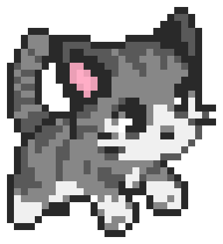

Criando---
layout: default
---

Criando **minha**, _página_, or ~~principal~~.

# Quem sou eu

Aluna do curso Técnico em Jogos Digitais, do IFRN Campus Ceará - mirim, aprendendo a fazer um portfólio com prof. Marcelo  

# Portfólio

## Games

*   
* [![] (Cancuns.png)] (https://alessandrats.github.io/CancunsTemple/)

*[TEXTO QUE VAI APARECER] (link)

## Artes

## Projetos

* Proj Teatro  
* Proj Musica  
* Proj Jogos  

1. Marcelo  
2. Saulo  
3. Tem ngm mais nao  

# Instruções

** negrito  
_ itálico  
~~ riscado  
3* cria linha horizontal  
#s uma ou mais hashtags criam capitulos ou sub   
*s adiciona lista não ordenada  

