# 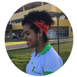 
# "Pássaros criados em gaiola acreditam que voar é doença" -Alejandro J.

# Quem sou eu  
Me chamo Alessandra Teixeira, tenho 18 anos, atualmente curso o terceiro ano do curso Técnico Integrado em Programação de Jogos Digitais, do IFRN Campus Ceará - mirim, estou usando este site para fazer um portfólio com prof. Marcelo Barbosa para a disciplina de Motores de Jogos II.

# Minha Empresa
 

# Portfólio

## Games

[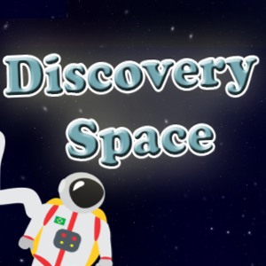](https://AlessandraTS.github.io/DiscoverySpace/)  

* **Descrição:**  

No jogo Discovery Space você é um astronauta em busca das peças de     
sua nave que quebrou no espaço sideral, divirta-se nessa aventura!  

* **Descrição:**  

Em uma aventura na floresta, o personagem George se perde e precisa   
entrar em um templo sangrado, mal sabia George o que lá encontraria...    

[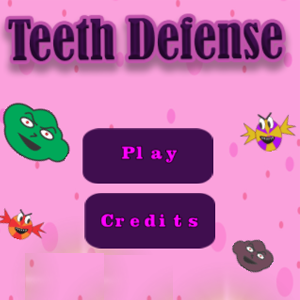](https://alessandrats.github.io/TeethDefense/)

* **Descrição:**  

Bactérias e cáries são as piores inimigas de uma boca, ajude-a nesta batalha!  

[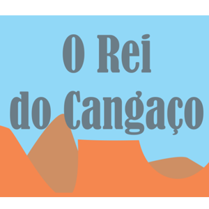](https://alessandrats.github.io/O%20Rei%20do%20Cangaco/)

* **Descrição:**  

Em busca por sua bela Maria Bonita, Lampião precisa enfrentar seus     
inimigos para chegar até sua amada.  

## Animações 
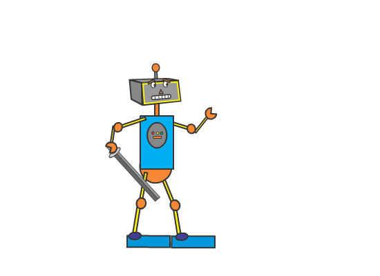
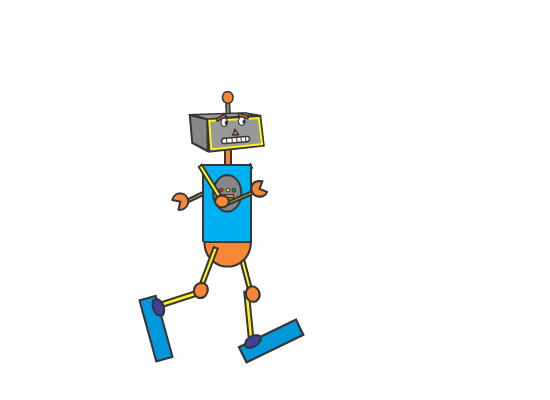
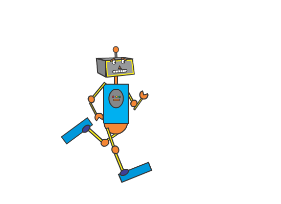
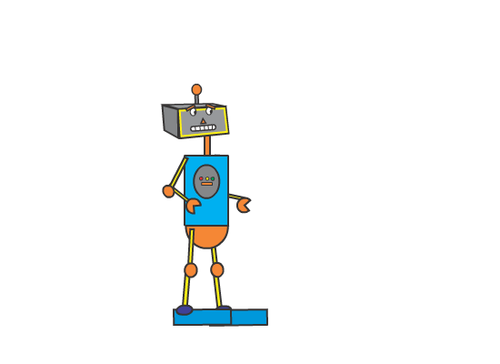

## Artes

### Jogo: Discovery Space
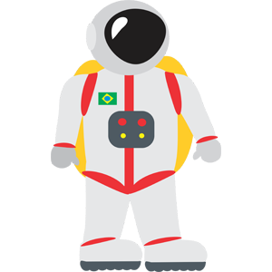

### Jogo: Cancun's Temple

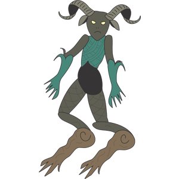

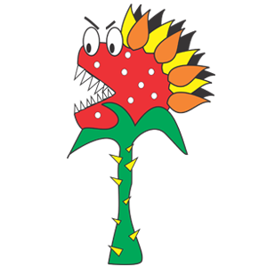

### Jogo: Teeth Defense

### Jogo: Rei do Cangaço 
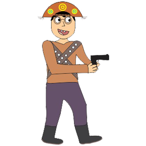

### PixelArt
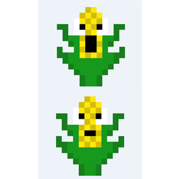

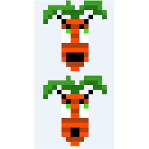

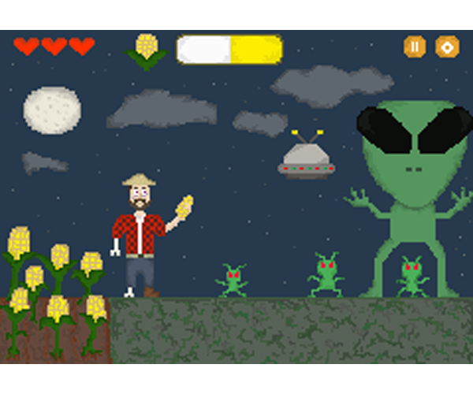 

## Projetos

* Proj English Club: visa a aprendizagem da língua inglesa.
* Proj Enem: busca pela aprovação em 2019 na Universidade Federal do RN. 
* Proj TCC: Jogos para crianças com TDAH (Transtorno de Déficit de Atenção e Hiperatividade)  
* Proj Jogos: Jogos realizados na disciplina de motores e oficina de jogos.

* * *

# Endereço para contato
* E-mail: Alessandrasilva1999@hotmail.com  
* Instagram: [Alessandratxs](https://www.instagram.com/Alessandratxs/)  
* Currículo Lattes: [Alessandra Teixeira](http://buscatextual.cnpq.br/buscatextual/visualizacv.do?id=K8073831H4)  

