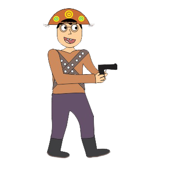

Criando---
layout: default
---

# Quem sou eu

Aluna do curso Técnico em Jogos Digitais, do IFRN Campus Ceará - mirim, aprendendo a fazer um portfólio com prof. Marcelo  

# Portfólio

## Games

  

* **Descrição:**  

No jogo Discovery Space você é um astronauta em busca das peças de   
sua nave que quebrou no espaço sideral, se divirta nessa aventura!

* **Descrição:**  

Em uma aventura na floresta, George se perde e precisa entrar em um  
templo sangrado, mal sabia George o que lá encontraria...  

* **Descrição:**  

Bactérias e cáries são as piores inimigas de uma boca, ajude-a nesta batalha!

* **Descrição:**  

* Em busca por sua bela Maria Bonita, Lampeão precisa enfrentar seus 
inimigos para chegar até sua amada.

*[TEXTO QUE VAI APARECER] (link)

## Artes
### Jogo: Discovery Space
    
    
    
    
    

### Jogo: Cancun's Temple
  
  
  

### Jogo: Teeth Defense
  
  

### Jogo: Rei do Cangaço 
  

### PixelArt
  

## Projetos

* Proj Enem  
* Proj TCC  
* Proj Jogos  

* * *

# Endereço para contato
* E-mail:
 Alessandrasilva1999@hotmail.com 
* Instagram:
 Alessandratxs
* Twitter:
 https://twitter.com/Aletxxs
* Telefone para contato:
 (84) 99429 - 4934

# Instruções

** negrito  
_ itálico  
~~ riscado  
3* cria linha horizontal  
#s uma ou mais hashtags criam capitulos ou sub   
*s adiciona lista não ordenada  

